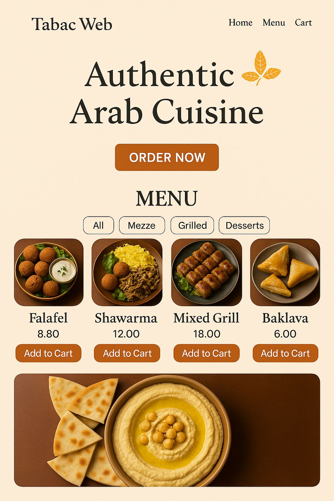

# TabacWeb

Aplicación web funcional para un restaurante ubicado en San Salvador de Jujuy, Argentina. Desarrollada como proyecto académico por Samara Nur Zamar, Giuliano Gani y Gino Grosso.

## Descripción

TabacWeb permite a los usuarios registrarse, iniciar sesión, explorar productos organizados por categorías, agregar productos al carrito de compras y realizar un proceso de pago simulado.


## Tecnologías utilizadas

- **Backend:** Node.js + Express
- **Base de datos:** MongoDB
- **Frontend:** React
- **Autenticación:** JSON Web Tokens (JWT)
- **Estilos:** CSS

## Funcionalidades

- Registro e inicio de sesión de usuarios
- Gestión de productos (altas, bajas, modificaciones), organizados por categorías
- Carrito de compras: agregar y eliminar productos
- Interfaz de pago simulada

## Figma
https://www.figma.com/design/zxQ9fsytMHd34UmeNZz8i2/Sin-t%C3%ADtulo?node-id=0-1&t=X8WmMvDbc1POvZH6-1 
## Instalación

1. Clonar el repositorio:

```bash
git clone https://github.com/tuusuario/tabac-web.git
cd tabac-web

